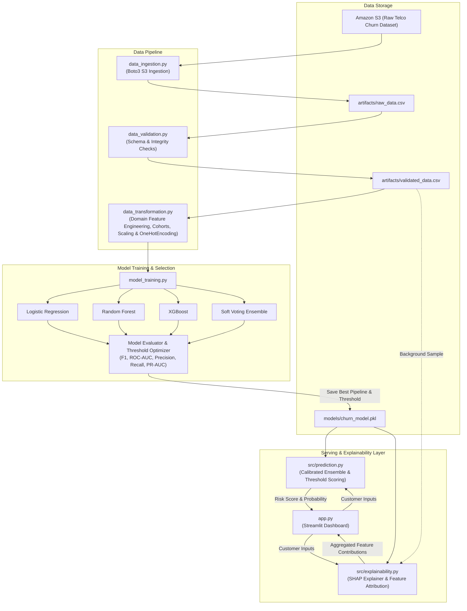

# ChurnShield

An end-to-end customer churn prediction system that predicts churn risk and provides interpretable explanations for individual predictions using SHAP.

## Overview

ChurnShield is built around a production-oriented machine learning and explainability pipeline:

**S3 → Data Ingestion → Data Validation → Feature Engineering → Multi-Model Benchmarking & Ensembling → Threshold Optimization → SHAP Explainability → Streamlit UI**

The project compares multiple classification models, tunes optimal decision thresholds, and exposes the final prediction through an interactive Streamlit application.

## Architecture



## Features

- **Automated Data Ingestion**: Secure retrieval from Amazon S3.
- **Dataset Validation & Preprocessing**: Automated schema integrity checks, type coercion, and deduplication.
- **Domain Feature Engineering**: Custom transformer calculating spend ratios (`AvgMonthlySpend`, `ChargeRatio`), service density (`ServiceCount`, `CostPerService`), billing discounts (`DiscountRatio`), tenure cohorts (`TenureCohort`), and critical customer segments (`IsHighRiskTriad`, `IsShortTenureMonthToMonth`).
- **Ensemble Modeling**: Soft Voting Ensemble combining calibrated Logistic Regression, Random Forest, and XGBoost models.
- **Decision Threshold Optimization**: Precision-Recall curve threshold tuning to balance recall and precision.
- **Aggregated SHAP Explainability**: Dynamic feature attribution that maps one-hot encoded variables back to original features, eliminating duplicate rows.
- **Interactive Streamlit Interface**: Real-time customer churn risk scoring, decision cutoffs, and side-by-side positive/negative factor analysis.

## Models Comparison

| Model | Optimal Threshold | Precision | Recall | F1 | ROC-AUC | PR-AUC |
|---|---:|---:|---:|---:|---:|---:|
| **Voting Ensemble** | **0.522** | **0.537** | **0.770** | **0.633** | **0.847** | **0.662** |
| Logistic Regression | 0.593 | 0.566 | 0.709 | 0.630 | 0.846 | 0.657 |
| XGBoost | 0.599 | 0.570 | 0.695 | 0.627 | 0.845 | 0.662 |
| Random Forest | 0.593 | 0.580 | 0.668 | 0.621 | 0.844 | 0.659 |

*The Soft Voting Ensemble achieved the highest ROC-AUC (0.847), PR-AUC (0.662), and Recall (0.770), successfully identifying 77% of all churners.*

## Project Structure

```text
ChurnShield/
├── src/
│   ├── data_ingestion.py        # S3 data ingestion
│   ├── data_validation.py       # Data verification & cleaning
│   ├── data_transformation.py   # Feature engineering & preprocessing pipelines
│   ├── model_training.py        # Multi-model training, ensemble, threshold tuning
│   ├── prediction.py            # Real-time inference service
│   └── explainability.py        # SHAP explainability engine
├── artifacts/                   # Local raw & validated datasets
├── models/                      # Serialized trained model pipeline bundle
├── app.py                       # Streamlit web application
├── requirements.txt             # Project dependencies
├── .env                         # Environment configurations
├── .gitignore
└── README.md
```

## Setup & Installation

1. Clone repository and install dependencies:

```bash
pip install -r requirements.txt
```

2. Configure AWS credentials using your local AWS configuration or environment variables.

3. Run the end-to-end pipeline:

```bash
python src/data_ingestion.py
python src/data_validation.py
python -m src.model_training
```

4. Launch the interactive dashboard:

```bash
streamlit run app.py
```

## Dataset

The project uses the IBM Telco Customer Churn dataset containing customer demographic, service subscriptions, contract terms, and billing information.

- **Target variable**: `Churn` (1 = Customer left, 0 = Customer stayed)

## Explainability

SHAP (SHapley Additive exPlanations) is used to explain individual predictions by computing the exact marginal contribution of each customer characteristic toward increasing or decreasing the model's estimated churn probability.

- Feature attributions are aggregated back to original customer variables to eliminate redundant one-hot encoding entries.
- Descriptions provide contextual analysis grounded in the customer's actual profile values.
- SHAP explanations describe model behavior and should not be interpreted as proof of causal relationships.

## Tech Stack

Python, Pandas, Scikit-learn, XGBoost, SHAP, Boto3, Joblib, Streamlit, Amazon S3
